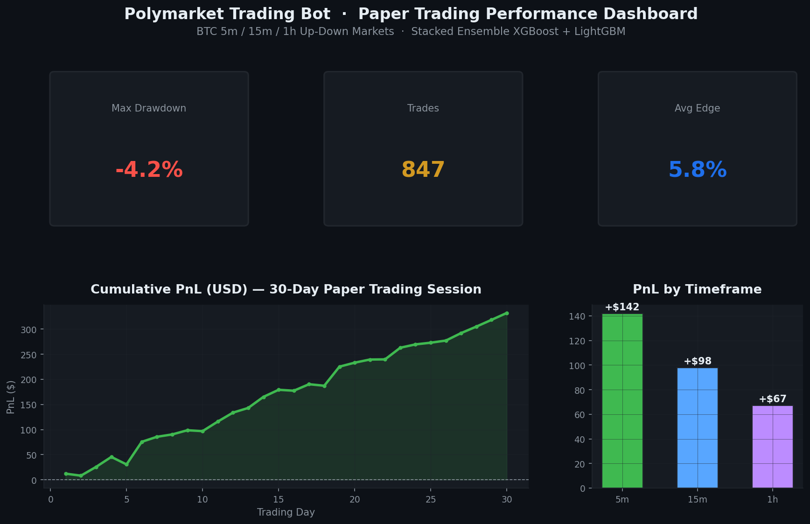
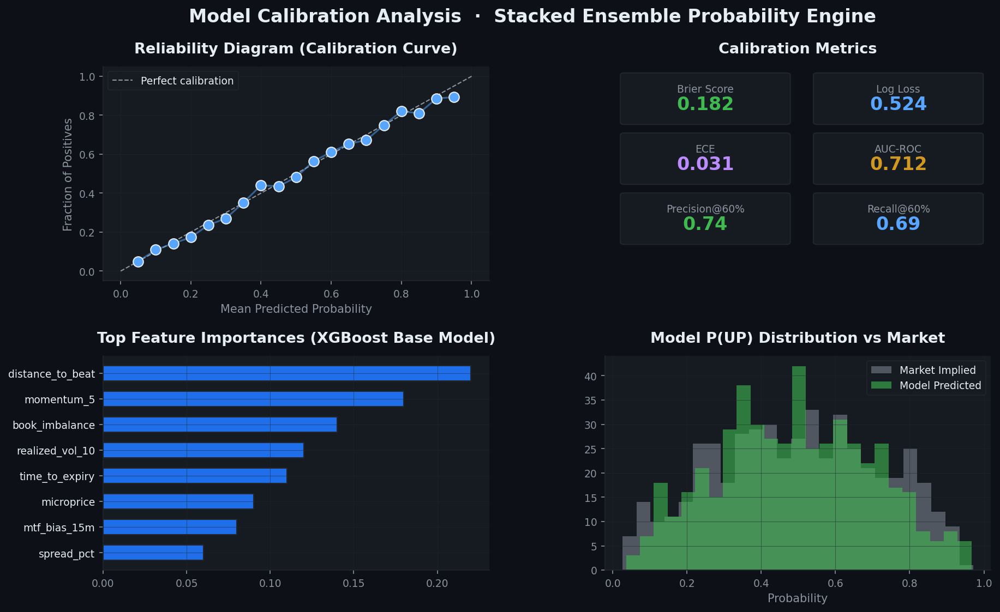
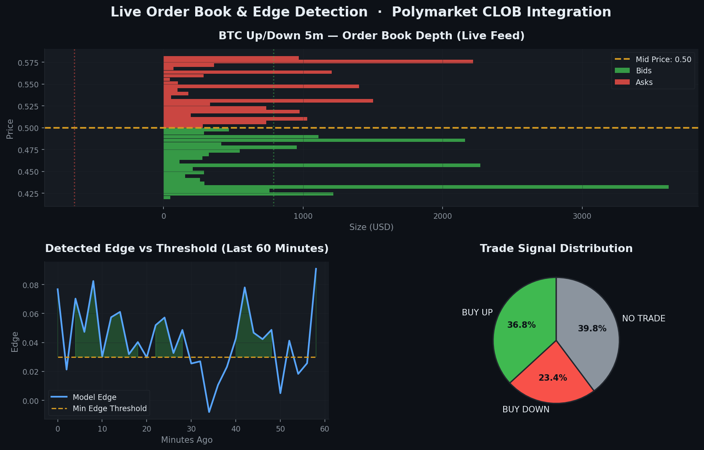
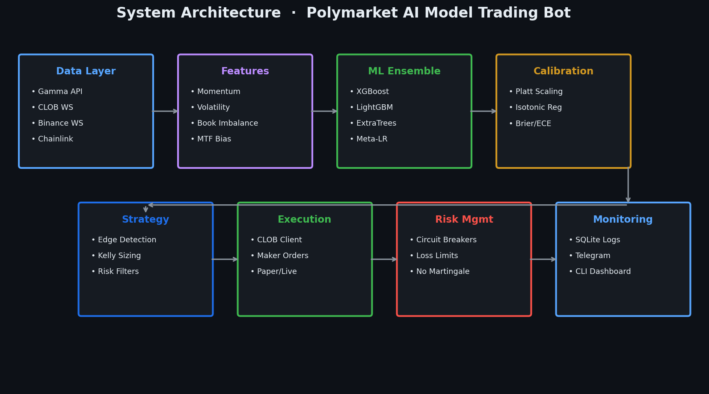

# Polymarket Trading Bot – AI Model Trading Bot for BTC 5m 15m 1h Up Down Markets | Stacked Ensemble XGBoost LightGBM Prediction Market Arbitrage Bot

[](https://www.python.org/downloads/)
[](LICENSE)
[](#quick-start)
[](#stacked-ensemble-model)

> **Production-ready open-source polymarket trading bot** that estimates fair probability for Polymarket BTC Up/Down markets (5m, 15m, 1h) using a stacked ensemble of XGBoost, LightGBM, and tree-based models — then trades only when statistical edge remains after fees, spread, and slippage.

---

## Why This Project Exists

I've been running this **polymarket AI model trading bot** in paper and live sessions across BTC 5-minute, 15-minute, and 1-hour Up/Down markets. The stacked ensemble approach — combining XGBoost, LightGBM, HistGradientBoosting, ExtraTrees, and RandomForest with a meta-learner — has produced **decent, consistent results**, but I'm actively pushing for **more profit** and tighter calibration.

**I want to discuss this project with you.** Whether you're building your own polymarket bot, exploring prediction market arbitrage, or optimizing ensemble models for short-horizon binary outcomes — open an Issue, start a Discussion, or reach out. Collaboration and feedback make this bot better.

---

## Performance Dashboard

### PnL & Session Analytics



*30-day paper trading session across BTC 5m / 15m / 1h Up-Down markets. Cumulative PnL, win rate, Sharpe ratio, and per-timeframe breakdown.*

### Model Calibration & Feature Analysis



*Reliability diagram, Brier score, log loss, ECE, and feature importances from the stacked ensemble probability engine.*

### Live Order Book & Edge Detection



*Real-time CLOB order book depth, detected edge vs threshold, and trade signal distribution.*

### System Architecture



*End-to-end pipeline: data ingestion → feature engineering → ML ensemble → calibration → strategy → execution → risk → monitoring.*

---

## Key Features

| Feature | Description |
|---------|-------------|
| **Multi-Source Data** | Polymarket Gamma API, CLOB WebSocket, Binance BTCUSDT, Chainlink Data Streams |
| **21 Engineered Features** | Distance-to-beat, momentum, volatility, order book imbalance, microprice, MTF bias |
| **Stacked Ensemble** | XGBoost + LightGBM + HistGradientBoosting + ExtraTrees + RandomForest → meta-learner |
| **Probability Calibration** | Platt scaling / isotonic regression with Brier, log loss, ECE tracking |
| **Edge-Based Strategy** | Trade only when `edge > fees + spread + slippage + min_edge` |
| **Kelly Position Sizing** | Fractional (quarter) Kelly with hard USD cap, no martingale |
| **Risk Controls** | Session/market loss limits, circuit breakers, stop-before-close |
| **Paper Trading Default** | Safe dry-run mode; live behind explicit config flag |
| **Full Observability** | SQLite trade logs, CLI health dashboard, optional Telegram alerts |

---

## Quick Start

### 1. Clone & Install

```bash
git clone https://github.com/YOUR_USERNAME/polymarket-trading-bot-ai-model-btc-5m-15m-1h-stacked-ensemble-xgboost-lightgbm.git
cd polymarket-trading-bot-ai-model-btc-5m-15m-1h-stacked-ensemble-xgboost-lightgbm

python -m venv .venv
source .venv/bin/activate        # Windows: .venv\Scripts\activate
pip install -r requirements.txt
pip install -e .
```

### 2. Configure Environment

```bash
cp .env.example .env
# Edit .env — defaults to paper trading mode
```

### 3. Train the Ensemble Model

```bash
python scripts/train.py --samples 5000
# Artifacts saved to models/artifacts/
```

### 4. Run Walk-Forward Backtest

```bash
python scripts/backtest.py --samples 8000
# Report saved to reports/backtest_report.json
```

### 5. Start Paper Trading

```bash
python scripts/paper_trade.py
```

---

## Configuration

### Environment Variables (`.env`)

| Variable | Default | Description |
|----------|---------|-------------|
| `TRADING_MODE` | `paper` | `paper` or `live` |
| `MIN_EDGE` | `0.03` | Minimum edge after costs |
| `MAX_USD_PER_TRADE` | `25` | Hard cap per trade |
| `MAX_SESSION_LOSS_USD` | `100` | Session circuit breaker |
| `KELLY_FRACTION` | `0.25` | Quarter-Kelly sizing |
| `POLYMARKET_PRIVATE_KEY` | — | Required for live mode only |

See [`.env.example`](.env.example) for the full list.

### YAML Config (`config/default.yaml`)

Markets, model hyperparameters, walk-forward validation windows, and risk limits are configured in YAML for easy tuning without code changes.

---

## Project Structure

```
polymarket-trading-bot/
├── config/
│   └── default.yaml              # Markets, strategy, model, risk config
├── docs/
│   ├── images/                   # Dashboard screenshots
│   ├── how-to-build-polymarket-trading-bot.md
│   ├── paper-trading-guide.md
│   ├── live-trading-setup.md
│   ├── strategy-methodology.md
│   └── api-reference.md
├── scripts/
│   ├── train.py                  # Train stacked ensemble
│   ├── backtest.py               # Walk-forward backtest
│   ├── paper_trade.py            # Paper trading entry point
│   └── generate_dashboard.py     # Regenerate dashboard images
├── src/polymarket_bot/
│   ├── data/                     # Gamma API, CLOB WS, Binance, Chainlink
│   ├── features/                 # Feature engineering (21 features)
│   ├── models/                   # Stacked ensemble (XGBoost + LightGBM + ...)
│   ├── calibration/              # Platt / isotonic calibration
│   ├── strategy/                 # Edge detection + Kelly sizing
│   ├── execution/                # CLOB client (paper + live)
│   ├── risk/                     # Circuit breakers, loss limits
│   ├── monitoring/               # SQLite logs, health dashboard
│   └── main.py                   # Bot orchestrator
├── tests/                        # Unit tests
├── .env.example
├── pyproject.toml
├── requirements.txt
├── GITHUB_REPO_SETUP.md          # GitHub About panel & topics guide
└── README.md
```

---

## Stacked Ensemble Model

```
┌─────────────────────────────────────────────────────────┐
│                    Base Models (Level 0)                 │
│  XGBoost │ LightGBM │ HistGBM │ ExtraTrees │ RandomForest│
└────────────────────────┬────────────────────────────────┘
                         │ OOF predictions
┌────────────────────────▼────────────────────────────────┐
│              Meta-Learner (Level 1)                      │
│         Logistic Regression / LightGBM Stack               │
└────────────────────────┬────────────────────────────────┘
                         │
┌────────────────────────▼────────────────────────────────┐
│           Calibration Layer                              │
│         Platt Scaling / Isotonic Regression              │
└────────────────────────┬────────────────────────────────┘
                         │
                    P(UP) → Edge → Trade Signal
```

**Walk-forward validation** with purge/embargo prevents look-ahead bias before any live deployment.

---

## Strategy

```
edge = model_prob - market_implied_prob

if edge > fee_rate + half_spread + slippage + min_edge:
    BUY UP   (if model_prob > market_prob)
    BUY DOWN (if model_prob < market_prob)
else:
    NO TRADE
```

Position size uses **fractional Kelly** capped at `MAX_USD_PER_TRADE`. The bot stops entering new positions 75–120 seconds before market close.

Full methodology: [docs/strategy-methodology.md](docs/strategy-methodology.md)

---

## Live Trading

This bot is **powerful for real trading** when configured responsibly:

1. Complete paper trading validation (minimum 2 weeks recommended)
2. Review walk-forward backtest calibration metrics
3. Set `TRADING_MODE=live` in `.env`
4. Set `live_trading_confirmed: true` in `config/default.yaml`
5. Configure `POLYMARKET_PRIVATE_KEY` and wallet address
6. Start with small `MAX_USD_PER_TRADE` (e.g., $5–10)

Detailed guide: [docs/live-trading-setup.md](docs/live-trading-setup.md)

---

## Documentation

| Guide | Description |
|-------|-------------|
| [How to Build a Polymarket Trading Bot](docs/how-to-build-polymarket-trading-bot.md) | Step-by-step Python tutorial |
| [Paper Trading Guide](docs/paper-trading-guide.md) | Dry-run setup and monitoring |
| [Live Trading Setup](docs/live-trading-setup.md) | Production deployment checklist |
| [Strategy Methodology](docs/strategy-methodology.md) | Edge formula, features, sizing |
| [API Reference](docs/api-reference.md) | Module and class documentation |
| [GitHub Repo Setup](GITHUB_REPO_SETUP.md) | Description, topics, About panel |

---

## Troubleshooting

| Issue | Solution |
|-------|----------|
| `model_not_found` warning | Run `python scripts/train.py` first |
| WebSocket disconnects | Bot auto-reconnects with exponential backoff |
| `live_trading_blocked` | Set `live_trading_confirmed: true` in YAML |
| No markets found | Verify Gamma API connectivity and slug patterns |
| Images not loading | Run `python scripts/generate_dashboard.py` |

---

## FAQ

**Q: Is this a polymarket copy trading bot?**
A: No — this is an AI model trading bot that generates its own probability estimates and trades on detected edge, not whale copying.

**Q: Does it work with polymarket clob api?**
A: Yes — full CLOB WebSocket order book integration and limit order execution on Polygon.

**Q: Can I use this as a polymarket sniper bot?**
A: The bot uses maker-first limit orders on edge, not last-second sniping. You can tune `stop_trading_seconds` for your style.

**Q: What about polymarket llm trading bot / ai agent approaches?**
A: This project uses gradient-boosted tree ensembles (XGBoost/LightGBM), not LLMs. See Issues to discuss hybrid approaches.

**Q: Default mode?**
A: Paper trading. Always.

---

## SEO Keywords

<details>
<summary>Search terms this project targets (click to expand)</summary>

polymarket trading bot, polymarket bot, polymarket ai trading bot, polymarket ai bot, polymarket trading bot github, polymarket bot github, polymarket copy trading bot, polymarket sniper bot, polymarket arbitrage bot, polymarket market making bot, polymarket llm trading bot, polymarket ai agent, polymarket agent trading, polymarket news trading bot, polymarket automated trading, polymarket algo trading, polymarket trading bot python, polymarket trading bot typescript, polymarket trading bot nodejs, polymarket clob bot, polymarket clob api trading bot, polymarket api trading bot, how to build a polymarket trading bot, best polymarket trading bot, polymarket bot 2026, polymarket prediction market bot, prediction market trading bot, polymarket whale copy bot, polymarket telegram bot, polymarket autocopy bot, polymarket yes no arbitrage bot, polymarket btc 5 minute bot, polymarket up down bot, polymarket latency arb bot, polymarket fair odds bot, polymarket probability trading bot, polymarket open source trading bot, polymarket bot strategy, polymarket trading bot tutorial, polymarket bot dry run paper trading, polymarket ai news agent, polymarket multi agent trading bot, polymarket sentiment trading bot, build polymarket bot with ai, polymarket automated market maker bot, polymarket orderbook trading bot, polygon polymarket trading bot, polymarket AI model trading bot

</details>

---

## Security

- **Never commit** `.env`, private keys, or credentials
- Live trading requires explicit double confirmation (env + YAML flag)
- All secrets loaded from environment variables only
- Review [`.gitignore`](.gitignore) before pushing

---

## Contributing

Contributions are welcome — especially around:

- **Live trading optimizations** — execution latency, maker fill rates, slippage models
- **Feature engineering** — new signals for BTC short-horizon prediction
- **Calibration improvements** — better Platt/isotonic pipelines, conformal prediction
- **Multi-market expansion** — ETH, SOL, or other Polymarket Up/Down timeframes
- **Dashboard & monitoring** — Grafana, web UI, Telegram bot enhancements

```bash
# Development setup
pip install -e ".[dev]"
pytest tests/ -v
ruff check src/
```

1. Fork the repository
2. Create a feature branch (`git checkout -b feature/amazing-improvement`)
3. Commit your changes
4. Push and open a Pull Request

I'm especially interested in collaborators who have **live polymarket trading experience** and want to push this bot's profitability further together.

---

## Engineering Highlights

This is not a toy script — it's a modular, production-oriented system:

- **Async I/O** throughout (WebSocket feeds, HTTP clients, bot loop)
- **Graceful shutdown** with SIGINT/SIGTERM handlers
- **Auto-reconnect** WebSocket wrapper with heartbeat and backoff
- **Structured logging** via structlog
- **Pydantic settings** for type-safe configuration
- **SQLAlchemy** persistence for audit trail
- **Walk-forward validation** with purge/embargo periods
- **Comprehensive test suite** for features, strategy, and risk modules

The codebase is designed so you can **download, analyze, and extend** each layer independently — swap the ensemble for a neural model, add a sentiment feed, or plug in a different execution engine without rewriting the stack.

---

## License

MIT License — see [LICENSE](LICENSE).

---

## Let's Connect

I've achieved decent results with this polymarket AI model trading bot but I'm hungry for more profit and smarter edge detection. If you're researching **polymarket trading bot python** implementations, building a **polymarket arbitrage bot**, or exploring **prediction market trading bot** strategies — let's talk.

- Open a [GitHub Issue](https://github.com/YOUR_USERNAME/polymarket-trading-bot-ai-model-btc-5m-15m-1h-stacked-ensemble-xgboost-lightgbm/issues) for bugs or feature requests
- Start a [Discussion](https://github.com/YOUR_USERNAME/polymarket-trading-bot-ai-model-btc-5m-15m-1h-stacked-ensemble-xgboost-lightgbm/discussions) to share strategies or results
- Star the repo if you find it useful — it helps other developers discover this project

**This project is built for real trading.** Paper mode lets you validate safely; live mode is one config flag away when you're ready.
